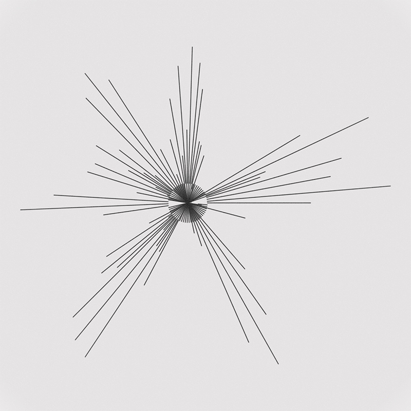

# gt_tpl_plot

Plottable generative token template for fxhash



## Features
- 1:1 aspect ratio
- Viewport resize handling
- Paper-like texture
- Doubleclick to save svg
- Margins collapse when viewport is square
- Automatically resize plot to fit canvas
- Invert colors option
- Simplex noise by [Jonas Wagner](https://github.com/jwagner/simplex-noise.js) and helper function by [brubsby](https://github.com/brubsby/cozyvec)
- fxhash random functions by [Karsten Schmidt](https://github.com/thi-ng/umbrella/tree/develop/packages/random-fxhash)

## Todo

- Bug: Invert artifact on ios

## Usage

```
npm i
npm start
```
- Edit `formula` in `src/index.js` (`m = moveTo, l = lineTo, j = relative MoveTo, t = relative lineTo`)

## Publishing

- Update project name in `package.json`
- Run `npm run build`
- Upload `dist/project.zip` at https://www.fxhash.xyz/mint-generative/
